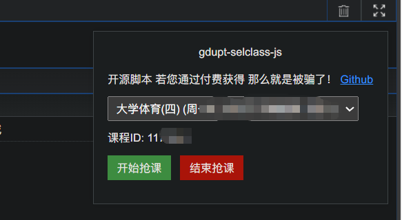
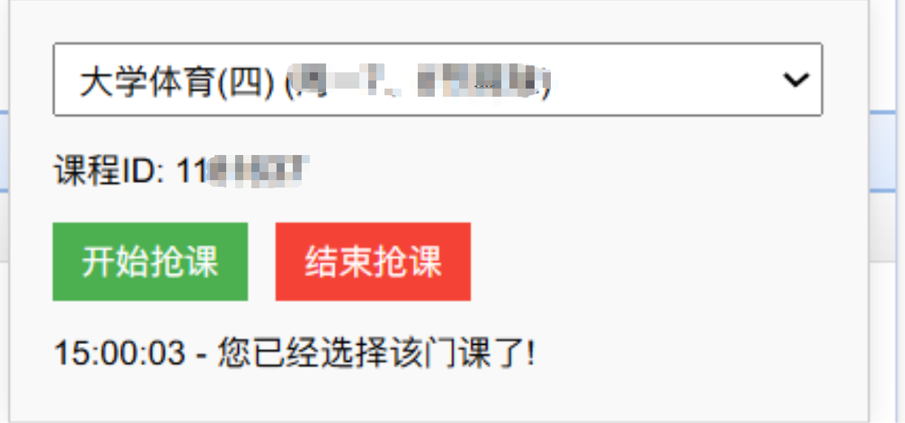

# gdupt-selclass-js
适用于广油的抢课脚本 油猴js脚本 直接在浏览器即可使用

对你有用的话 点个⭐吧~

  

***<u>请勿将本脚本用于任何盈利用途，谢谢！</u>***

<u>为了防止有心之人倒卖，脚本暂时进行了代码混淆，如有特别需要源码，可以联系我哦~</u>

## 食用方法

1.使用任一脚本加载器（scriptcat/油猴/暴力猴 都行）安装仓库中的插件```抢课脚本.js```（直接全选复制过去都行，不会就去百度吧）
(优先用这个 有时候油猴UI加载不出来 不知道为啥)推荐：[https://microsoftedge.microsoft.com/addons/detail/%E8%84%9A%E6%9C%AC%E7%8C%AB/liilgpjgabokdklappibcjfablkpcekh?hl=zh-CN](https://microsoftedge.microsoft.com/addons/detail/%E8%84%9A%E6%9C%AC%E7%8C%AB/liilgpjgabokdklappibcjfablkpcekh?hl=zh-CN)

2.打开教务系统选课页面，脚本页面会在选课页面的左上角加载 ***<u>如果脚本界面没有看见 请换用Scriptcat</u>***



3.选择你想上的课程，在抢课开始前10秒点击开始抢课即可，出现以下提示代表抢课成功！然后就可以刷新页面去看你抢到的课程啦！



Tips：总体就是，提前10分钟左右打开选课页面，选择好课程，等到快到点开放的时候点击开始抢课即可！（到点后是不需要刷新页面的哦！也就是不需要等到```选课```按钮出现，提前10来秒点开始就好啦！）
